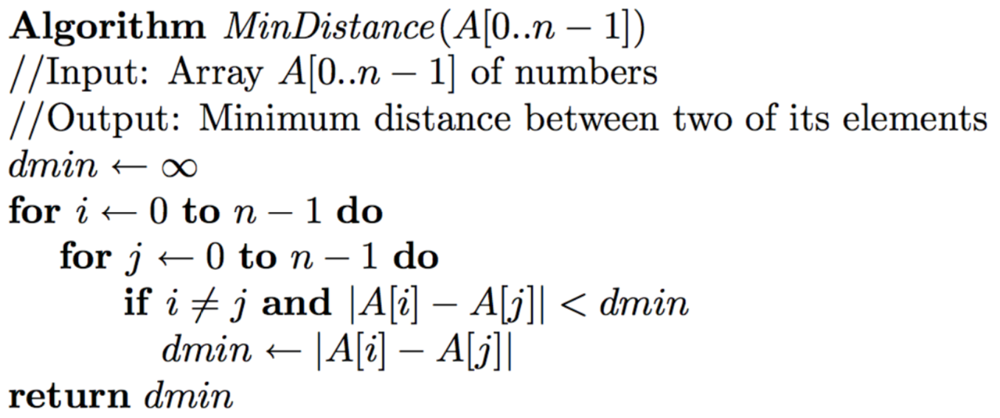
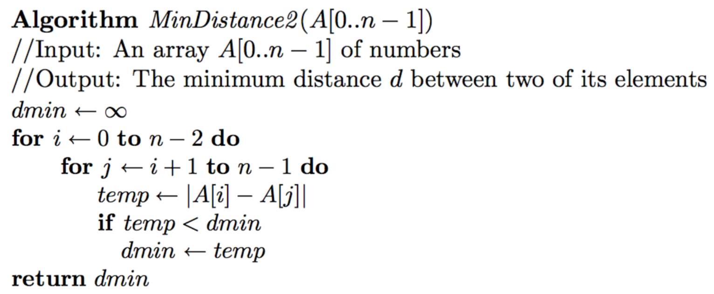
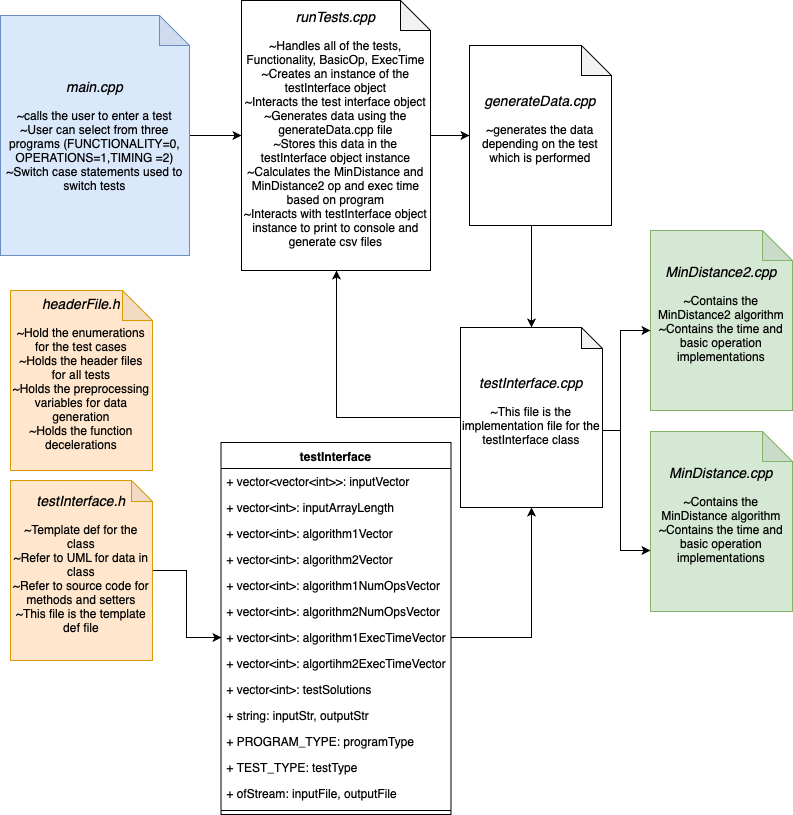

#Comparison Algorithm Implementation#
This is an implementation in c++ to compare two algorithms. 
The algorithms are to find the minimum distance between two elements in an array.
The pseudocode for both algorithms can be found below.

#MinDistance#

#MinDistance2

#Program overview#
The overview of the program can be found below

#Report#
The report can be found under the Report.pdf file. This report contains the 
methodology for analysis the theoretical and emperical efficiencies of both algorithms.
